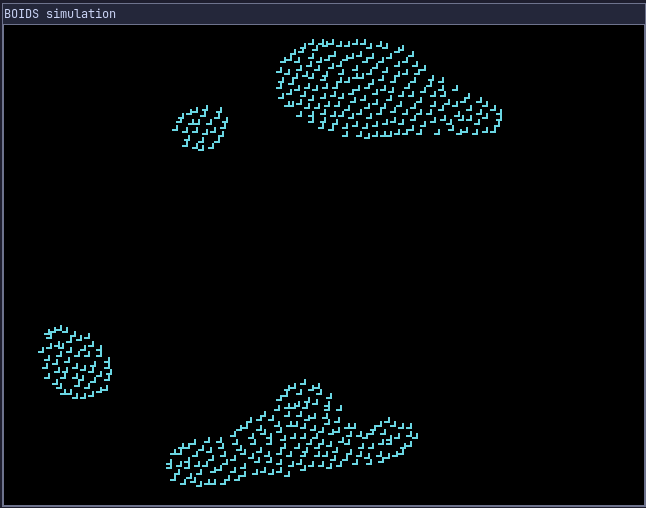

<h1 align="center"><a href="https://en.wikipedia.org/wiki/Boids">boids<a/></h1>

A simple simulation of [Boids](https://en.wikipedia.org/wiki/Boids) in [Go](https://go.dev/) using [Ebitengine](https://ebitengine.org/).

<div align="center"> 
    
    <p>demo.gif</p>
</div>

### Getting started

- Install system dependencies Ebitengine depends on

  ```sh
  sudo apt install gcc libc6-dev libgl1-mesa-dev libxcursor-dev libxi-dev libxinerama-dev libxrandr-dev libxxf86vm-dev libasound2-dev pkg-config
  ```

  Or follow the official [Ebitengine installation guide](https://ebitengine.org/en/documents/install.html)

- Clone the repository

  ```sh
  git clone git@github.com:x-incubator/boids.git && cd boids
  ```

- Add go dependencies

  ```sh
  go mod tidy
  ```

- Execute program

  ```sh
  go run .
  ```
